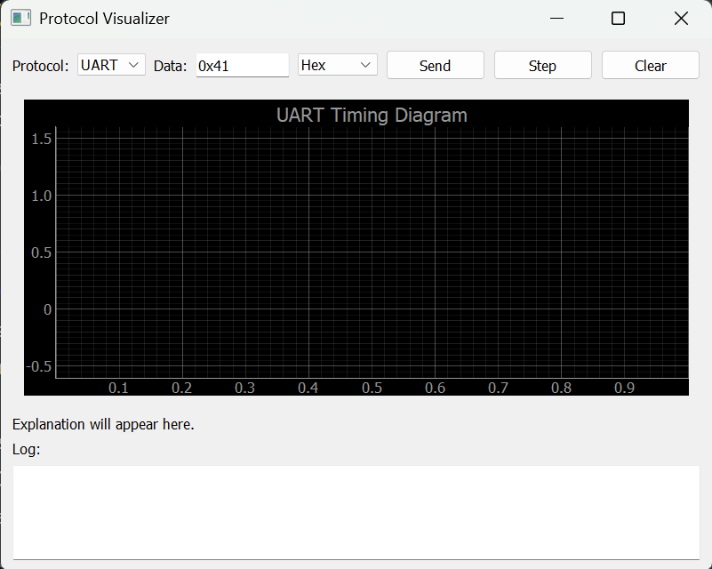

# Protocol-Visualizer

A graphical tool to simulate and visualize basic embedded protocols like **UART**, **I2C**, and **SPI**. The primary goal of this project is to make understanding these communication protocols intuitive and interactive.

---

## Features

- **Interactive GUI:** Built using **PyQt5**.
- **Protocol Simulation:** Supports UART (currently), with I2C and SPI planned.
- **Waveform Visualization:** Clearly labeled start, data, and stop bits.
- **Step-by-Step Mode:** Visualize the data transmission one bit at a time.
- **Data Format Support:** Accepts **Hex**, **Binary**, and **Decimal** inputs.
- **LSB to MSB Representation:** Demonstrates the **LSB-first** nature of UART transmission.
- **Educational Mode:** Explains each part of the waveform with labeled bits.

---

## How It Works

1. Select the protocol (currently only UART).
2. Enter the data value in the chosen format (Hex, Binary, Decimal).
3. Click **"Send"** to generate the waveform.
4. Click **"Step"** to view the transmission bit by bit.
5. Use **"Clear"** to reset the waveform.

### Example:
- Enter data as **Binary:** `01000001`.
- The waveform will display: Start | LSB: 1 | Bit 2: 0 | Bit 3: 0 | Bit 4: 0 | Bit 5: 0 | Bit 6: 0 | Bit 7: 1 | MSB: 0 | Stop
- This shows the **LSB-first** transmission characteristic of UART.

---

## Project Structure
ProtocolSimulator/
├── gui/
│   ├── app_window.py         # Main GUI logic
│   └── visualizer.py         # Waveform visualization
├── protocols/
│   └── uart.py               # UART simulation logic
├── main.py                   # Entry point for the application
├── .venv/                    # Virtual environment (not tracked)
├── README.md                 # Project documentation
└── requirements.txt          # Dependencies

---

## Getting Started

1. **Clone the repository:**
git clone https://github.com/yourusername/Protocol-Visualizer.git
cd Protocol-Visualizer

2. **Set up the virtual environment:**
python -m venv .venv
source .venv/bin/activate # On Windows: .venv\Scripts\activate

3. **Install the dependencies:**
pip install -r requirements.txt

4. **Run the application:**
python main.py

---

## Screenshot

Include a screenshot here for better understanding:

---

## Contributing

1. Fork the repository.
2. Create a new branch: `git checkout -b feature-branch`
3. Make your changes and commit: `git commit -m "Add feature"`
4. Push to your branch: `git push origin feature-branch`
5. Open a Pull Request.

---

## License

This project is licensed under the MIT License - see the [LICENSE](LICENSE) file for details.

---

## Feedback

If you have any suggestions or issues, feel free to open an issue in the repository.
